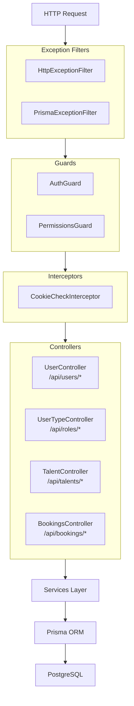
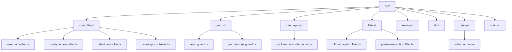

<p align="center">
  <a href="http://nestjs.com/" target="blank"></a>
</p>

# Talent & Booking Management API

## Description

This is a **NestJS-based backend API** for managing talents, bookings, users, and roles. It provides a structured, scalable foundation with features like JWT authentication, role-based permissions, cookie-based sessions, and comprehensive CRUD operations.

## Table of Contents
- [Features](#features)
- [Tech Stack](#tech-stack)
- [Architecture Overview](#architecture-overview)
  - [Key Components](#key-components)
  - [Directory Structure](#directory-structure)
- [Project setup](#project-setup)
- [Run tests](#run-tests)
- [API Documentation](#api-documentation)
  - [User Management](#user-management)
  - [Roles Management](#roles-management)
  - [Talents Management](#talents-management)
  - [Bookings Management](#bookings-management)
- [Error Responses](#error-responses)
- [Notes](#notes)
- [License](#license)

## Features
- User authentication with JWT & HTTP-only cookies
- Role-based access control (RBAC)
- Talent discovery and management
- Booking and scheduling system
- Search and filtering capabilities
- RESTful API with consistent response format

## Tech Stack
- **Backend:** NestJS
- **Authentication:** JWT, bcrypt
- **Validation:** class-validator, class-transformer
- **API Design:** RESTful principles

## Architecture Overview




### Key Components

#### 1. Guards
- **AuthGuard**: Validates JWT tokens from cookies, attaches user to request
- **PermissionsGuard**: Implements RBAC with configurable permission structures
  - Maps HTTP methods to CRUD operations
  - Resource-based permission checking
  - Extensible permission matrix

#### 2. Interceptors
- **CookieCheckInterceptor**: Monitors and logs cookie operations for debugging
  - Logs cookie setting operations
  - Provides visibility into authentication flow

#### 3. Exception Filters
- **HttpExceptionFilter**: Standardizes HTTP error responses
  - Consistent error format: `{ success: false, message, error }`
  - Proper status code mapping
- **PrismaExceptionFilter**: Handles database-specific errors
  - `P2002` → 409 Conflict (unique constraint)
  - `P2025` → 404 Not Found (record not found)
  - Other → 500 Internal Server Error

#### 4. Database Layer
- **Prisma ORM**: Type-safe database access
- **Migrations**: Managed via Prisma CLI
- **Database**: PostgreSQL with proper relations

### Directory Structure




## Project setup

```bash
$ npm install
```

## Compile and run the project

```bash
# development
$ npm run start

# watch mode
$ npm run start:dev

# production mode
$ npm run start:prod
```

## Run tests

```bash
# unit tests
$ npm run test

# e2e tests
$ npm run test:e2e

# test coverage
$ npm run test:cov
```

# API Documentation

## Base URL
```
https://booking-and-availability-api.onrender.com/
```
*Replace with your actual deployment URL*

## Authentication
Most endpoints require authentication using JWT tokens. Include the token in cookies or Authorization header.

## Response Format
All endpoints return a consistent response format:
```json
{
  "success": true,
  "data": {},
  "message": "Success message"
}
```

---

## User Management

### Authentication Endpoints

#### Sign Up
```http
POST /api/users/auth/sign-up
```
**Description:** Register a new user

**Body:**
```json
{
  "email": "string",
  "password": "string",
  "name": "string",
  "roleId": "string"
}
```

**Response:**
```json
{
  "success": true,
  "data": { "userId": "string", "email": "string" },
  "message": "User created successfully"
}
```

#### Sign In
```http
POST /api/users/auth/sign-in
```
**Description:** Authenticate user and set session cookie

**Body:**
```json
{
  "email": "string",
  "password": "string"
}
```

**Response:** Sets `token` cookie and returns:
```json
{
  "success": true,
  "data": {
    "userId": "string",
    "roleType": "string"
  },
  "message": "User signed in successfully"
}
```

#### Sign Out
```http
POST /api/users/auth/sign-out
```
**Description:** Clear authentication cookie

**Headers:** Requires authentication

**Response:** Clears `token` cookie

---

### User Management Endpoints

#### Get All Users
```http
GET /api/users
```
**Headers:** Requires authentication and permissions

**Response:**
```json
{
  "success": true,
  "data": [
    {
      "id": "string",
      "email": "string",
      "name": "string",
      "role": "string"
    }
  ],
  "message": "Users retrieved successfully"
}
```

#### Get User by ID
```http
GET /api/users/:id
```
**Headers:** Requires authentication and permissions

**Parameters:**
- `id` (path): User ID

**Response:**
```json
{
  "success": true,
  "data": {
    "id": "string",
    "email": "string",
    "name": "string",
    "role": "string"
  },
  "message": "User retrieved successfully"
}
```

#### Update User
```http
PUT /api/users/update/:userId
```
**Headers:** Requires authentication and permissions

**Parameters:**
- `userId` (path): User ID to update

**Body:**
```json
{
  "name": "string",
  "email": "string"
}
```

**Response:**
```json
{
  "success": true,
  "data": { "updated": true },
  "message": "User updated successfully"
}
```

#### Delete User
```http
DELETE /api/users/delete/:userId
```
**Headers:** Requires authentication and permissions

**Parameters:**
- `userId` (path): User ID to delete

**Response:**
```json
{
  "success": true,
  "data": { "deleted": true },
  "message": "User deleted successfully"
}
```

---

## Roles Management

### Role Endpoints

#### Get All Roles
```http
GET /api/roles
```
**Response:**
```json
{
  "success": true,
  "data": [
    {
      "id": "string",
      "name": "string",
      "permissions": ["string"]
    }
  ],
  "message": "Users Roles retrieved successfully"
}
```

#### Get Role by ID
```http
GET /api/roles/:id
```
**Parameters:**
- `id` (path): Role ID

**Response:**
```json
{
  "success": true,
  "data": {
    "id": "string",
    "name": "string",
    "permissions": ["string"]
  },
  "message": "User Role retrieved successfully"
}
```

#### Create Role
```http
POST /api/roles/create
```
**Body:**
```json
{
  "name": "string",
  "permissions": ["string"]
}
```

**Response:**
```json
{
  "success": true,
  "data": { "id": "string", "name": "string" },
  "message": "User Role created successfully"
}
```

#### Update Role
```http
PUT /api/roles/update/:id
```
**Parameters:**
- `id` (path): Role ID to update

**Body:**
```json
{
  "name": "string",
  "permissions": ["string"]
}
```

**Response:**
```json
{
  "success": true,
  "data": { "updated": true },
  "message": "User Role updated successfully"
}
```

#### Delete Role
```http
DELETE /api/roles/delete/:id
```
**Parameters:**
- `id` (path): Role ID to delete

**Response:**
```json
{
  "success": true,
  "data": { "deleted": true },
  "message": "User Role deleted successfully"
}
```

---

## Talents Management

### Talent Endpoints

#### Get All Talents
```http
GET /api/talents
```
**Headers:** Requires authentication and permissions

**Response:**
```json
{
  "success": true,
  "data": [
    {
      "id": "string",
      "name": "string",
      "talent": "string",
      "skills": ["string"],
      "rate": "number"
    }
  ],
  "message": "Talents retrieved Successfully"
}
```

#### Get Talents by Talent Type
```http
GET /api/talents/:talent
```
**Headers:** Requires authentication and permissions

**Parameters:**
- `talent` (path): Talent category/type

**Response:**
```json
{
  "success": true,
  "data": [
    {
      "id": "string",
      "name": "string",
      "talent": "string",
      "skills": ["string"]
    }
  ],
  "message": "Talents retrieved Successfully"
}
```

#### Search Talents
```http
GET /api/talents/search/:value
```
**Headers:** Requires authentication and permissions

**Parameters:**
- `value` (path): Search term

**Response:**
```json
{
  "success": true,
  "data": [
    {
      "id": "string",
      "name": "string",
      "talent": "string",
      "skills": ["string"]
    }
  ],
  "message": "Talents retrieved Successfully"
}
```

#### Create Talent
```http
POST /api/talents/create
```
**Headers:** Requires authentication and permissions

**Body:**
```json
{
  "name": "string",
  "talent": "string",
  "skills": ["string"],
  "rate": "number",
  "userId": "string"
}
```

**Response:**
```json
{
  "success": true,
  "data": { "id": "string", "name": "string" },
  "message": "Talent created successfully"
}
```

#### Update Talent
```http
PUT /api/talents/update/:userId/:id
```
**Headers:** Requires authentication and permissions

**Parameters:**
- `userId` (path): User ID
- `id` (path): Talent ID

**Body:**
```json
{
  "name": "string",
  "talent": "string",
  "skills": ["string"],
  "rate": "number"
}
```

**Response:**
```json
{
  "success": true,
  "data": { "updated": true },
  "message": "Talent updated successfully"
}
```

#### Delete Talent
```http
DELETE /api/talents/delete/:id
```
**Headers:** Requires authentication and permissions

**Parameters:**
- `id` (path): Talent ID to delete

**Response:**
```json
{
  "success": true,
  "data": { "deleted": true },
  "message": "Talent deleted successfully"
}
```

---

## Bookings Management

### Booking Endpoints

#### Get Talent Bookings
```http
GET /api/bookings/:talentId
```
**Headers:** Requires authentication and permissions

**Parameters:**
- `talentId` (path): Talent ID

**Response:**
```json
{
  "success": true,
  "data": [
    {
      "id": "string",
      "talentId": "string",
      "clientId": "string",
      "date": "string",
      "time": "string",
      "status": "pending|accepted|rejected|cancelled"
    }
  ],
  "message": "Bookings retrieved successfully"
}
```

#### Get Booking by ID
```http
GET /api/bookings/id
```
**Headers:** Requires authentication and permissions

**Parameters:**
- `id` (path): Booking ID

**Response:**
```json
{
  "success": true,
  "data": {
    "id": "string",
    "talentId": "string",
    "clientId": "string",
    "date": "string",
    "time": "string",
    "status": "string"
  },
  "message": "Bookings retrieved successfully"
}
```

#### Request Booking
```http
POST /api/bookings/request
```
**Headers:** Requires authentication and permissions

**Body:**
```json
{
  "talentId": "string",
  "clientId": "string",
  "date": "string",
  "time": "string",
  "duration": "number",
  "notes": "string"
}
```

**Response:**
```json
{
  "success": true,
  "data": { "bookingId": "string", "status": "pending" },
  "message": "Booking created successfully"
}
```

#### Update Booking Status
```http
PUT /api/bookings/update/:id
```
**Headers:** Requires authentication and permissions

**Parameters:**
- `id` (path): Booking ID

**Body:**
```json
{
  "action": "accept|reject"
}
```

**Response:**
```json
{
  "success": true,
  "data": { "status": "accepted|rejected" },
  "message": "Booking accepted/rejected successfully"
}
```

#### Reschedule Booking
```http
PUT /api/bookings/reschedule/:id
```
**Headers:** Requires authentication and permissions

**Parameters:**
- `id` (path): Booking ID

**Body:**
```json
{
  "date": "string",
  "time": "string"
}
```

**Response:**
```json
{
  "success": true,
  "data": { "rescheduled": true },
  "message": "Booking rescheduled successfully"
}
```

#### Cancel Booking
```http
PUT /api/bookings/cancel/:id
```
**Headers:** Requires authentication and permissions

**Parameters:**
- `id` (path): Booking ID

**Response:**
```json
{
  "success": true,
  "data": { "cancelled": true },
  "message": "Booking canceled successfully"
}
```

---

## Error Responses

### Common Error Codes:
- `400` - Bad Request (Invalid input)
- `401` - Unauthorized (Missing/invalid authentication)
- `403` - Forbidden (Insufficient permissions)
- `404` - Not Found (Resource doesn't exist)
- `500` - Internal Server Error

### Error Response Format:
```json
{
  "success": false,
  "message": "Error description",
  "error": "Error details (optional)"
}
```

---

## Notes
1. All timestamps are in ISO 8601 format
2. IDs are UUID strings
3. Authentication is required for most endpoints (except sign-up, sign-in)
4. Some endpoints require specific user permissions
5. Date formats should be YYYY-MM-DD
6. Time formats should be HH:MM (24-hour format)

---

## License

Nest is [MIT licensed](https://github.com/nestjs/nest/blob/master/LICENSE).
